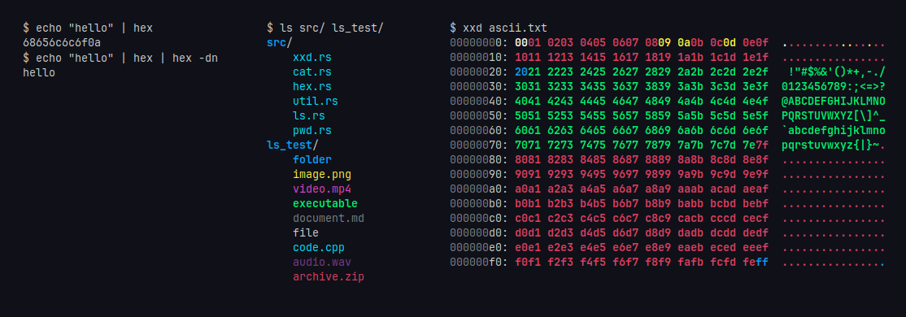

# Commands
`ls` List files\
`pwd` Print working directory\
`cat` Print a file or STDIN\
`hex` Encode/decode hex\
`xxd` Visualize as hex\
`ascii` ASCII-range bytes

# Building
`cargo build --release`\
The built binaries will be located in `./target/release/`

# Installing
```console
cd
git clone https://github.com/kivattt/tutils
cd tutils
cargo build --release
```
Then add this to your `.bashrc` file, and re-open a terminal
```bash
tutilspath=~/tutils/target/release
if test -d $tutilspath; then
        alias ls="$tutilspath/ls"
        alias pwd="$tutilspath/pwd"
        alias cat="$tutilspath/cat"
        alias hex="$tutilspath/hex"
        alias xxd="$tutilspath/xxd"
        alias ascii="$tutilspath/ascii"
else
        echo "Could not find tutils programs in $tutilspath"
fi
```

Since adding `tutils` to your path environment variable could break existing scripts that rely on system utilities specific behaviour, we use shell aliases so that shell scripts will continue to use the existing utilities, rather than `tutils`.

# Known issues
xxd output isn't deterministic, it can have some "breaks" randomly depending on how many bytes it could read into a buffer at a time
